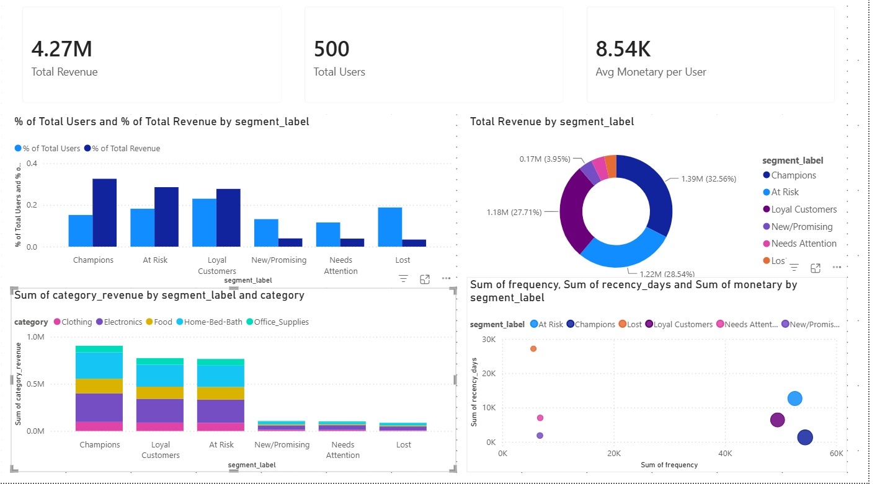

# Amazon-customer-rfm-segmentation-sql
RFM customer segmentation analysis using SQL on Amazon purchase data

# Customer Segmentation via RFM Analysis (SQL)

A SQL-based customer segmentation project using RFM (Recency, Frequency,
Monetary) analysis on a 500-user sample of Amazon purchase data, with a
Power BI dashboard for visualization.

## Business Problem

Companies can't treat every customer the same. Without a systematic way to
tell high-value loyal customers apart from ones who've quietly stopped
purchasing, retention and marketing budgets get spread evenly across
customers who don't need the same treatment. This project uses the RFM
framework to segment customers by:

- *Recency* — how recently did they last purchase?
- *Frequency* — how often do they purchase?
- *Monetary* — how much have they spent in total?

## Dataset

- Source: Amazon purchase/survey dataset (~1.85M rows, 5,000 unique users)
- Sample used: 500 randomly sampled users (full transaction history retained
  per user, ~150K-200K transaction rows)
- Date range: January 2018 – March 2023
- See [data/sample_data_dictionary.md](data/sample_data_dictionary.md) for
  full schema. *Raw data is not included* in this repo due to respondent-level
  demographic fields.

## Methodology

1. *Data cleaning* — parsed year/month/day text fields into proper dates,
   handled "Unknown" category values, resolved CSV encoding/quoting issues
   from the source export
2. *RFM calculation* — computed recency, frequency, and monetary value per
   user using CTEs/views
3. *Quintile scoring* — used NTILE(5) window functions to score each user
   1-5 on each RFM dimension
4. *Segment labeling* — applied business logic (CASE statements) to convert
   R/F/M scores into named segments: Champions, Loyal Customers, At Risk,
   New/Promising, Needs Attention, Lost
5. *Segment-level insights* — aggregated revenue, frequency, and recency by
   segment; calculated each segment's share of total revenue using RANK()
   and SUM() OVER() window functions
6. *Category affinity check* — tested whether purchase categories differ
   by segment

Full SQL script: [sql/rfm_analysis.sql](sql/rfm_analysis.sql)

## Key Findings

| Segment | Users | % of Users | Total Revenue | % of Revenue |
|---|---|---|---|---|
| Champions | 76 | 15.2% | $1.39M | 32.6% |
| At Risk | 91 | 18.2% | $1.22M | 28.5% |
| Loyal Customers | 115 | 23.0% | $1.18M | 27.7% |
| New/Promising | 66 | 13.2% | $0.17M | 3.9% |
| Needs Attention | 58 | 11.6% | $0.16M | 3.9% |
| Lost | 94 | 18.8% | $0.14M | 3.4% |

*Headline insight:* "At Risk" customers make up only 18.2% of the user base
but generate 28.5% of total revenue — nearly matching Loyal Customers (23%
of users) in revenue contribution, despite having gone an average of ~139
days without a purchase. This is a strong candidate for targeted
re-engagement/win-back campaigns, likely offering better ROI than
retention spend distributed evenly across the customer base.

*Secondary finding:* category preferences (Electronics, Home-Bed-Bath,
Food as the top 3) were nearly identical across all six segments. This
suggests re-engagement strategies should focus on timing/incentive levers
rather than category-specific targeting, since purchasing behavior doesn't
meaningfully diverge by category across segments.

## Dashboard

Built in Power BI: KPI summary cards, segment revenue/user share comparison,
revenue distribution donut, RFM cluster scatter plot, and category
breakdown by segment.

## Tools Used

PostgreSQL (CTEs, views, window functions: NTILE, RANK, SUM() OVER()),
Power BI (DAX measures, data visualization), Python/pandas (initial data
sampling and export)

## Repository Structure

├── README.md
├── sql/
│   └── rfm_analysis.sql
├── data/
│   └── sample_data_dictionary.md
└── dashboard/
    └── rfm_dashboard_screenshot.png

## Author

Hariharan Jothimani
Vaishnavi Perka
